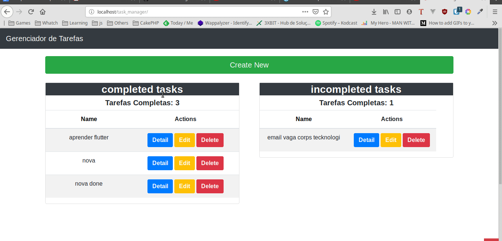

# CakePHP Application Skeleton

[](https://travis-ci.org/cakephp/app)
[](https://packagist.org/packages/cakephp/app)

A skeleton for creating applications with [CakePHP](https://cakephp.org) 3.x.

The framework source code can be found here: [cakephp/cakephp](https://github.com/cakephp/cakephp).

## Project setup

After clone this repository running this following command to install all project dependencies.
```
composer install
```

## Configuration

Read and edit `config/app.php` and setup the `'Datasources'` and any other
configuration relevant for your application.

## Layout

For the layouts of page iam using [Bootstrap4](https://getbootstrap.com.br/)


## Demonstration 1


## Demonstration 2



Get in Touch
===============

I am available facebook **brunojamelli9**  linkedin **bruno-jamelli**  gmail **@brunogeek9**

More details about this project [here](https://medium.com/@brunojamelli/meu-primeiro-contato-com-o-cakephp-7d1db451891a)
